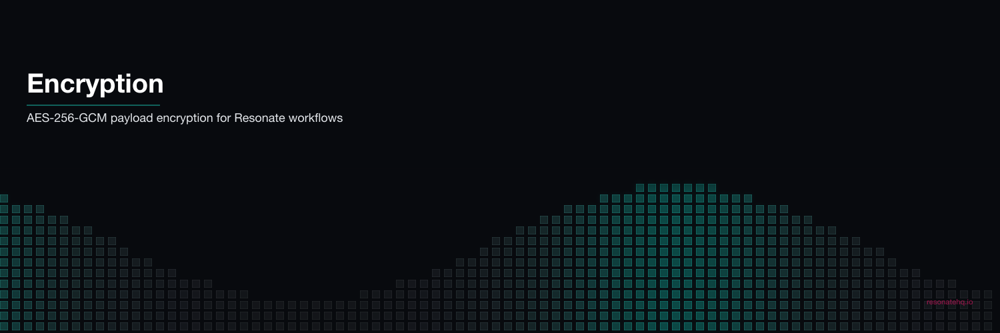

<p align="center">
  
</p>

# Encryption Middleware

AES-256-GCM encryption for Resonate promise payloads. Sensitive data — credit cards, SSNs, financial amounts — is encrypted at rest in the promise store. Your workflow code is unchanged.

## What This Demonstrates

- **Transparent encryption**: plug in the encryptor, all promise data is encrypted automatically
- **PII protection**: credit card numbers, SSNs, and amounts are never stored in plaintext
- **Crash recovery with encrypted state**: retry reads encrypted checkpoints, decrypts transparently
- **Zero business logic changes**: encryption is injected via the SDK's `encryptor` option

## How It Works

Resonate's SDK accepts an `Encryptor` interface with two methods: `encrypt()` and `decrypt()`. The `AesGcmEncryptor` class implements this with AES-256-GCM:

```typescript
const encryptor = new AesGcmEncryptor(ENCRYPTION_KEY, "demo-key-v1");
const resonate = new Resonate({ encryptor });
```

That's it. Every value passing through the promise store — function arguments, return values, intermediate state — is encrypted before storage and decrypted on read.

## Prerequisites

- [Bun](https://bun.sh) v1.0+

No external services required. Resonate runs in embedded mode. No encryption key management service needed for the demo (key is hardcoded; in production, load from KMS).

## Setup

```bash
git clone https://github.com/resonatehq-examples/example-encryption-ts
cd example-encryption-ts
bun install
```

## Run It

**Happy path** — process payment with all data encrypted at rest:
```bash
bun start
```

```
=== Encryption Demo ===

Plaintext payload (base64-encoded JSON):
  eyJjcmVkaXRDYXJkIjoiNDExMS0xMTExLTExMTEtMTExMSIsInNzbiI6IjEyMy00NS02Nzg5In0=
  Decoded: {"creditCard":"4111-1111-1111-1111","ssn":"123-45-6789","amount":499.99}

Encrypted payload (what's stored in the promise store):
  mG6IM6M1eRRoYtAkHTTkcT6ujhYrx8qsujHv8Soh7v6Ty5m92ZCUv0...
  Headers: {"x-encrypted":"true","x-encryption-key-id":"demo-key-v1"}

=== Encrypted Payment Workflow ===
Mode: HAPPY PATH (all PII encrypted at rest throughout)

  [validate]  order-xxx — card ***************1111 validated
  [fraud]     order-xxx — $299.99 cleared fraud check
  [charge]    order-xxx — charged $299.99 to ***************1111
  [receipt]   order-xxx — receipt sent for $299.99

=== Result ===
{ "orderId": "order-xxx", "steps": ["validated","cleared","charged","receipt_sent"], "wallTimeMs": 208 }
```

**Crash mode** — payment gateway fails, retries with encrypted state:
```bash
bun start:crash
```

```
  [validate]  order-xxx — card ***************1111 validated
  [fraud]     order-xxx — $299.99 cleared fraud check
  [charge]    order-xxx — payment gateway timeout (retrying...)
Runtime. Function 'chargeCard' failed with 'Error: Payment gateway timeout' (retrying in 2 secs)
  [charge]    order-xxx — charged $299.99 to ***************1111 (retry 2)
  [receipt]   order-xxx — receipt sent for $299.99

Notice: validate and fraud check logged once (cached before crash).
Charge failed → retried → succeeded. PII never stored in plaintext.
```

## What to Observe

1. **Encryption demo at startup**: shows plaintext → encrypted → decrypted round-trip
2. **Encrypted headers**: `x-encrypted: true` and `x-encryption-key-id` tag every encrypted payload
3. **No code changes**: [`src/workflow.ts`](src/workflow.ts) has zero encryption imports — it just handles payments
4. **Crash recovery**: on retry, the SDK decrypts cached checkpoints transparently

## The Code

The encryptor is ~50 lines in [`src/encryptor.ts`](src/encryptor.ts):

```typescript
export class AesGcmEncryptor implements Encryptor {
  encrypt(plaintext: Value): Value {
    if (!plaintext.data) return plaintext;
    const iv = randomBytes(IV_LENGTH);
    const cipher = createCipheriv("aes-256-gcm", this.rawKey, iv);
    const encrypted = Buffer.concat([cipher.update(plaintext.data, "utf8"), cipher.final()]);
    const tag = cipher.getAuthTag();
    return {
      headers: { ...plaintext.headers, "x-encrypted": "true", "x-encryption-key-id": this.keyId },
      data: Buffer.concat([iv, encrypted, tag]).toString("base64"),
    };
  }

  decrypt(ciphertext: Value | undefined): Value | undefined {
    if (!ciphertext?.data) return ciphertext;
    if (ciphertext.headers?.["x-encrypted"] !== "true") return ciphertext;
    // ... symmetric decryption
  }
}
```

The workflow code in [`src/workflow.ts`](src/workflow.ts) handles credit cards and financial data with no awareness of encryption.

## File Structure

```
example-encryption-ts/
├── src/
│   ├── index.ts       Entry point — key setup, Resonate config, demo runner
│   ├── encryptor.ts   AES-256-GCM encryptor — implements Encryptor interface
│   └── workflow.ts    Payment workflow — handles PII, no encryption code
├── package.json
└── tsconfig.json
```

**Lines of code**: ~195 total, ~50 lines of encryptor implementation.

## Comparison

Temporal's `encryption` example requires 7 source files (~249 LOC), 12 runtime dependencies, a `PayloadCodec` with protobuf serialization, a `DataConverter` wired into both Client and Worker, and a separate Express "codec server" (~85 LOC) for the Web UI to display decrypted payloads.

Inngest's middleware-encryption is simpler: `encryptionMiddleware({ key })` — but it's a black box. You can't customize the algorithm or key management.

Resonate: implement one interface (2 methods), pass it to the constructor. You own the crypto.

| | Resonate | Temporal | Inngest |
|---|---|---|---|
| Encryptor implementation | 1 class, ~50 LOC | PayloadCodec + DataConverter + protobuf (~105 LOC) | 0 LOC (package) |
| Additional infrastructure | None | Codec server (~85 LOC Express app) | None |
| Wiring points | 1 (constructor option) | 2 (Client + Worker) | 1 (middleware) |
| Algorithm control | Full (you write the crypto) | Full (you write the crypto) | Limited (LibSodium default) |
| Key rotation | Implement yourself | Implement yourself | Built-in |
| Runtime dependencies | 1 (`@resonatehq/sdk`) | 12 packages | 2 packages |
| Workflow code changes | None | None | None |

**Honest trade-off**: Inngest's middleware-encryption is the easiest to use (3 lines, built-in key rotation). Temporal gives you full control but at high complexity cost. Resonate hits the middle: clean interface, you own the implementation, minimal ceremony.

## Learn More

- [Resonate documentation](https://docs.resonatehq.io)
- [Temporal encryption sample](https://github.com/temporalio/samples-typescript/tree/main/encryption)
- [Inngest encryption middleware](https://www.inngest.com/docs/features/middleware/encryption-middleware)
