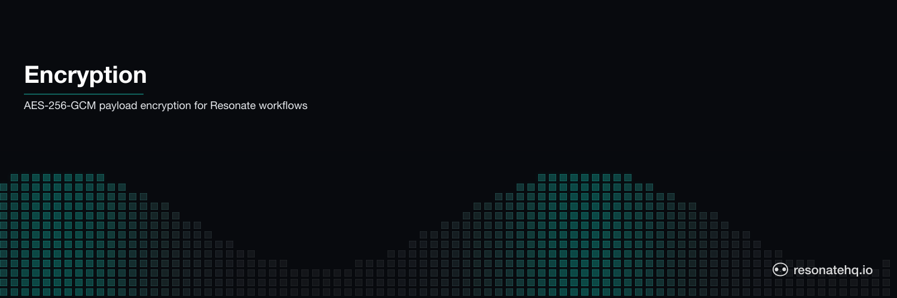

<p align="center">
  <picture>
    <source media="(prefers-color-scheme: dark)" srcset="./assets/banner-dark.png">
    <source media="(prefers-color-scheme: light)" srcset="./assets/banner-light.png">
    
  </picture>
</p>

# Encryption Middleware

AES-256-GCM encryption for Resonate promise payloads. Sensitive data — credit cards, SSNs, financial amounts — is encrypted at rest in the promise store. Your workflow code is unchanged.

## What This Demonstrates

- **Transparent encryption**: plug in the encryptor, all promise data is encrypted automatically
- **PII protection**: credit card numbers, SSNs, and amounts are never stored in plaintext
- **Crash recovery with encrypted state**: retry reads encrypted checkpoints, decrypts transparently
- **Zero business logic changes**: encryption is injected via the SDK's `encryptor` option

## How It Works

Resonate's SDK accepts an `Encryptor` interface with two methods: `encrypt()` and `decrypt()`. The `AesGcmEncryptor` class implements this with AES-256-GCM:

```typescript
const encryptor = new AesGcmEncryptor(ENCRYPTION_KEY, "demo-key-v1");
const resonate = new Resonate({ encryptor });
```

That's it. Every value passing through the promise store — function arguments, return values, intermediate state — is encrypted before storage and decrypted on read.

## Prerequisites

- [Bun](https://bun.sh) v1.0+

No external services required. Resonate runs in embedded mode. No encryption key management service needed for the demo (key is hardcoded; in production, load from KMS).

## Setup

```bash
git clone https://github.com/resonatehq-examples/example-encryption-ts
cd example-encryption-ts
bun install
```

## Run It

**Happy path** — process payment with all data encrypted at rest:
```bash
bun start
```

```
=== Encryption Demo ===

Plaintext payload (base64-encoded JSON):
  eyJjcmVkaXRDYXJkIjoiNDExMS0xMTExLTExMTEtMTExMSIsInNzbiI6IjEyMy00NS02Nzg5In0=
  Decoded: {"creditCard":"4111-1111-1111-1111","ssn":"123-45-6789","amount":499.99}

Encrypted payload (what's stored in the promise store):
  mG6IM6M1eRRoYtAkHTTkcT6ujhYrx8qsujHv8Soh7v6Ty5m92ZCUv0...
  Headers: {"x-encrypted":"true","x-encryption-key-id":"demo-key-v1"}

=== Encrypted Payment Workflow ===
Mode: HAPPY PATH (all PII encrypted at rest throughout)

  [validate]  order-xxx — card ***************1111 validated
  [fraud]     order-xxx — $299.99 cleared fraud check
  [charge]    order-xxx — charged $299.99 to ***************1111
  [receipt]   order-xxx — receipt sent for $299.99

=== Result ===
{ "orderId": "order-xxx", "steps": ["validated","cleared","charged","receipt_sent"], "wallTimeMs": 208 }
```

**Crash mode** — payment gateway fails, retries with encrypted state:
```bash
bun start:crash
```

```
  [validate]  order-xxx — card ***************1111 validated
  [fraud]     order-xxx — $299.99 cleared fraud check
  [charge]    order-xxx — payment gateway timeout (retrying...)
Runtime. Function 'chargeCard' failed with 'Error: Payment gateway timeout' (retrying in 2 secs)
  [charge]    order-xxx — charged $299.99 to ***************1111 (retry 2)
  [receipt]   order-xxx — receipt sent for $299.99

Notice: validate and fraud check logged once (cached before crash).
Charge failed → retried → succeeded. PII never stored in plaintext.
```

## What to Observe

1. **Encryption demo at startup**: shows plaintext → encrypted → decrypted round-trip
2. **Encrypted headers**: `x-encrypted: true` and `x-encryption-key-id` tag every encrypted payload
3. **No code changes**: [`src/workflow.ts`](src/workflow.ts) has zero encryption imports — it just handles payments
4. **Crash recovery**: on retry, the SDK decrypts cached checkpoints transparently

## The Code

The encryptor is ~50 lines in [`src/encryptor.ts`](src/encryptor.ts):

```typescript
export class AesGcmEncryptor implements Encryptor {
  encrypt(plaintext: Value): Value {
    if (!plaintext.data) return plaintext;
    const iv = randomBytes(IV_LENGTH);
    const cipher = createCipheriv("aes-256-gcm", this.rawKey, iv);
    const encrypted = Buffer.concat([cipher.update(plaintext.data, "utf8"), cipher.final()]);
    const tag = cipher.getAuthTag();
    return {
      headers: { ...plaintext.headers, "x-encrypted": "true", "x-encryption-key-id": this.keyId },
      data: Buffer.concat([iv, encrypted, tag]).toString("base64"),
    };
  }

  decrypt(ciphertext: Value | undefined): Value | undefined {
    if (!ciphertext?.data) return ciphertext;
    if (ciphertext.headers?.["x-encrypted"] !== "true") return ciphertext;
    // ... symmetric decryption
  }
}
```

The workflow code in [`src/workflow.ts`](src/workflow.ts) handles credit cards and financial data with no awareness of encryption.

## File Structure

```
example-encryption-ts/
├── src/
│   ├── index.ts       Entry point — key setup, Resonate config, demo runner
│   ├── encryptor.ts   AES-256-GCM encryptor — implements Encryptor interface
│   └── workflow.ts    Payment workflow — handles PII, no encryption code
├── package.json
└── tsconfig.json
```

**Lines of code**: ~195 total, ~50 lines of encryptor implementation.

## The Encryptor interface

The integration point is a single interface with two methods: `encrypt(data)` and `decrypt(data)`. Implement it in whatever shape your key management and algorithm choice demand, then pass an instance to the `Resonate` constructor. No additional wiring, no separate codec server, no runtime-dependency pile. You own the crypto; Resonate calls the two methods at the payload boundary.

Key rotation, envelope encryption, KMS integration — all live in your implementation. The README's reference implementation uses AES-256-GCM with a static key; a production implementation would typically add per-payload key derivation and rotation.

## Learn More

- [Resonate documentation](https://docs.resonatehq.io)
